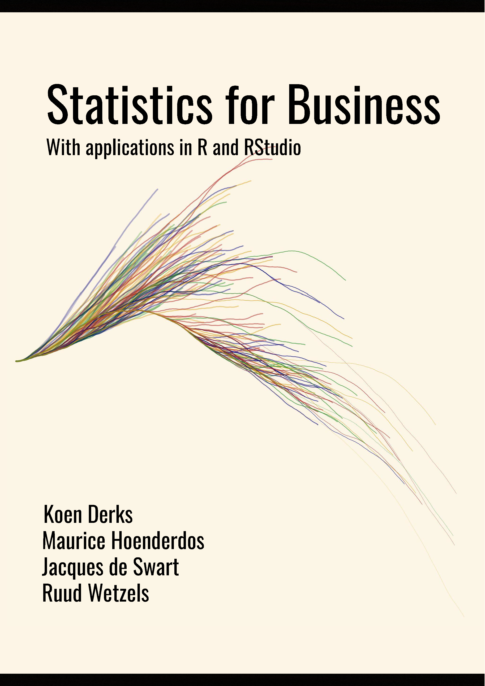

# Statistics for Business with Applications in R and RStudio

Download the complete course workbook (version 0.1.0) [here](https://github.com/koenderks/Statistics-for-Business-with-applications-in-R-and-RStudio/raw/master/Statistics%20for%20Business%20with%20applications%20in%20R%20and%20RStudio.pdf) or download one of the chapters via the links below.

	

## Introduction

* [Installing and setting up R and RStudio](https://github.com/koenderks/Statistics-for-Business-with-applications-in-R-and-RStudio/raw/master/Chapters/Installing%20and%20setting%20up%20R%20and%20RStudio.pdf)
* [Introduction to the workbook](https://github.com/koenderks/Statistics-for-Business-with-applications-in-R-and-RStudio/raw/master/Chapters/Introduction%20to%20the%20workbook.pdf)

## Chapters

* [Chapter 1 - Descriptive statistics](https://github.com/koenderks/Statistics-for-Business-with-applications-in-R-and-RStudio/raw/master/Chapters/Chapter%201%20-%20Descriptive%20statistics.pdf)
* [Chapter 2 - Creating graphs from data](https://github.com/koenderks/Statistics-for-Business-with-applications-in-R-and-RStudio/raw/master/Chapters/Chapter%202%20-%20Creating%20graphs%20from%20data.pdf)
* [Chapter 3 - Confidence intervals and hypothesis testing](https://github.com/koenderks/Statistics-for-Business-with-applications-in-R-and-RStudio/raw/master/Chapters/Chapter%203%20-%20Confidence%20intervals%20and%20hypothesis%20testing.pdf)
* [Chapter 4 - Correlation and regression](https://github.com/koenderks/Statistics-for-Business-with-applications-in-R-and-RStudio/raw/master/Chapters/Chapter%204%20-%20Correlation%20and%20regression.pdf)
* [Chapter 5 - Comparing one or two means](https://github.com/koenderks/Statistics-for-Business-with-applications-in-R-and-RStudio/raw/master/Chapters/Chapter%205%20-%20Comparing%20one%20or%20two%20means.pdf)
* [Chapter 6 - Comparing more than two means](https://github.com/koenderks/Statistics-for-Business-with-applications-in-R-and-RStudio/raw/master/Chapters/Chapter%206%20-%20Comparing%20more%20than%20two%20means.pdf)
* [Chapter 7 - Comparing proportions and distributions](https://github.com/koenderks/Statistics-for-Business-with-applications-in-R-and-RStudio/raw/master/Chapters/Chapter%207%20-%20Comparing%20proportions%20and%20distributions.pdf)
* [Chapter 8 - Bayesian statistics](https://github.com/koenderks/Statistics-for-Business-with-applications-in-R-and-RStudio/raw/master/Chapters/Chapter%208%20-%20Bayesian%20statistics.pdf)

## Appendices

* [Appendix A - Preparation and examination](https://github.com/koenderks/Statistics-for-Business-with-applications-in-R-and-RStudio/raw/master/Chapters/Appendix%20A%20-%20Preparation%20and%20Examination.pdf)
* [Appendix B - Resources](https://github.com/koenderks/Statistics-for-Business-with-applications-in-R-and-RStudio/raw/master/Chapters/Appendix%20B%20-%20Resources.pdf)
* [Appendix C - R help](https://github.com/koenderks/Statistics-for-Business-with-applications-in-R-and-RStudio/raw/master/Chapters/Appendix%20C%20-%20R%20help.pdf)
* [Appendix E - R exercises](https://github.com/koenderks/Statistics-for-Business-with-applications-in-R-and-RStudio/raw/master/Chapters/Appendix%20D%20-%20R%20exercises.pdf)
* [Appendix E - Answers](https://github.com/koenderks/Statistics-for-Business-with-applications-in-R-and-RStudio/raw/master/Chapters/Appendix%20E%20-%20Answers.pdf)

## Data sets

The links below redirect you to the raw data files. You can `right click` + `save as` to save these files as `.csv` files to your computer.

* [bloodPressure.csv](https://raw.githubusercontent.com/koenderks/Statistics-for-Business-with-applications-in-R-and-RStudio/master/LaTeX/Files/Online%20resources/bloodPressure.csv)
* [populations.csv](https://raw.githubusercontent.com/koenderks/Statistics-for-Business-with-applications-in-R-and-RStudio/master/LaTeX/Files/Online%20resources/populations.csv)
* [localSupermarket.csv](https://raw.githubusercontent.com/koenderks/Statistics-for-Business-with-applications-in-R-and-RStudio/master/LaTeX/Files/Online%20resources/localSupermarket.csv)
* [nationalSupermarket.csv](https://raw.githubusercontent.com/koenderks/Statistics-for-Business-with-applications-in-R-and-RStudio/master/LaTeX/Files/Online%20resources/nationalSupermarket.csv)
* [eyeColor.csv](https://raw.githubusercontent.com/koenderks/Statistics-for-Business-with-applications-in-R-and-RStudio/master/LaTeX/Files/Online%20resources/eyeColor.csv)
* [insurance.csv](https://raw.githubusercontent.com/koenderks/Statistics-for-Business-with-applications-in-R-and-RStudio/master/LaTeX/Files/Online%20resources/insurance.csv)